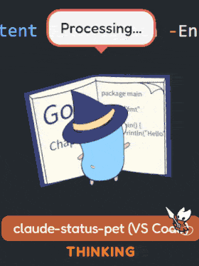

# Claude Status Pet

[English](README.md) | [中文](README.zh-CN.md)

[](https://github.com/moeyui1/claude-status-pet/actions/workflows/release.yml)
[](https://github.com/moeyui1/claude-status-pet/releases/latest)
[](https://github.com/moeyui1/claude-status-pet/releases/latest)
[](LICENSE)
[](https://github.com/moeyui1/claude-status-pet/releases)
[](https://www.rust-lang.org/)

A desktop pet that shows what your AI coding assistant is doing — in real time. 🦀

<table>
<tr>
<td align="center">

</td>
<td align="center">

</td>
<td align="center">

</td>
<td align="center">

</td>
</tr>
</table>

<details>
<summary>📸 More screenshots</summary>
<br>
<table>
<tr>
<td align="center">

</td>
</tr>
</table>
</details>

## Quick Start

**Claude Code** — Plugin install:

```
/plugin marketplace add moeyui1/claude-status-pet
/plugin install claude-status-pet
```

**GitHub Copilot CLI** — Run inside a Copilot CLI session:

```
/plugin marketplace add moeyui1/claude-status-pet-copilot
/plugin install claude-status-pet-copilot@claude-status-pet-copilot
```

**VS Code Copilot** — Plugin install:

Open Command Palette → `Chat: Install Plugin From Source` → enter `https://github.com/moeyui1/claude-status-pet`

Then run `/pet update` to download the binary and assets.

**Or ask your AI agent** (any of the above):

> Read https://raw.githubusercontent.com/moeyui1/claude-status-pet/main/docs/INSTALL.md and install it for me

> **⚠️ After first installation, restart your agent session** for the hooks and skill to take effect.

That's it! A pet will appear on your next session. 🎉

## Features

- 🔴 **Real-time status** — watch your pet react as the assistant reads, edits, searches, thinks
- 🎭 **15+ characters** — Ferris (SVG), Mona & Kuromi (GIF), Go Gopher (SVG), Fluent Emoji & Cat (PNG), and 6 ASCII art buddies
- 💃 **Animated** — unique animations per state (floating, wiggling, bouncing, sleeping)
- 🪟 **Multi-session** — each session gets its own pet window
- 🎨 **Customizable** — right-click to change character, colors, font size
- ⚡ **Lightweight** — ~5MB binary, ~20MB RAM (built with Tauri)

## Usage

**Right-click** the pet to open the menu:
- Switch character (Ferris, Go Gopher, Mona, Kuromi, Fluent Emoji, Fluent Cat, Chonk, Cat, Ghost, Robot, Duck, Axolotl, Snail)
- Customize colors, background, font size
- Exit the pet

**`/pet` commands** (in Claude Code, Copilot CLI, or VS Code Copilot):

| Command | Action |
|---------|--------|
| `/pet` or `/pet on` | Launch the pet |
| `/pet update` | Update binary, hooks, skill, and assets |
| `/pet status` | Show config and active sessions |

> **Tip:** Switch characters and customize colors via the right-click menu.

### Create Your Own Character

Ask your AI assistant:

> Read https://raw.githubusercontent.com/moeyui1/claude-status-pet/main/docs/CUSTOM-CHARACTERS.md and create a custom character pack for me

## Compatibility

| AI Agent | Plugin Install | Status |
|----------|:---:|--------|
| [Claude Code](https://docs.anthropic.com/en/docs/claude-code) (CLI) | ✅ | Fully supported |
| [GitHub Copilot CLI](https://docs.github.com/en/copilot/how-tos/copilot-cli) | ✅ | Fully supported |
| VS Code Copilot (Agent Mode) | ✅ | Fully supported |
| Cursor | — | Not supported yet |
| OpenCode | — | Not supported yet |

> Want to add support for another agent? See [Adding a New Adapter](CONTRIBUTING.md#adding-a-new-ai-agent-adapter).
>
> 💡 Multiple agents can run simultaneously — each gets its own pet window.

## Other Installation Methods

<details>
<summary>🔧 Build from source</summary>

Prerequisites: [Rust](https://rustup.rs/), [Node.js](https://nodejs.org/)

```bash
git clone https://github.com/moeyui1/claude-status-pet.git
cd claude-status-pet/pet-app
npm install
npx tauri build
```

Binary output: `pet-app/src-tauri/target/release/claude-status-pet(.exe)`

</details>

## Uninstall

The easiest way — run in your AI assistant:

```
/pet uninstall
```

This stops the pet, removes all data, scripts, and assets. Then uninstall the plugin:

- Claude Code: `/plugin uninstall claude-status-pet`
- Copilot CLI: `/plugin uninstall claude-status-pet-copilot@claude-status-pet-copilot` (inside Copilot CLI session)
- VS Code: Command Palette → `Chat: Uninstall Plugin`

## How It Works

```
🤖 AI Assistant ──hook event──▶ 📝 write-status ──JSON──▶ 🦀 Desktop Pet (Tauri)
(Claude / Copilot)              status-{id}.json          file watcher → UI update
```

The pet is **decoupled from any specific tool** — it just watches a JSON status file. See [`docs/HOOKS.md`](docs/HOOKS.md) for the full hook event → status mapping and how to add support for other assistants.

## Credits

- **Ferris**: [free-ferris-pack](https://github.com/MariaLetta/free-ferris-pack) by Maria Letta (CC0)
- **Go Gopher**: [gophers](https://github.com/egonelbre/gophers) by Egon Elbre (CC0), original design by Renee French
- **Fluent Emoji**: [fluentui-emoji](https://github.com/microsoft/fluentui-emoji) by Microsoft (MIT)
- **Mona**: [GitHub on GIPHY](https://giphy.com/GitHub) (downloaded at runtime)
- **Kuromi**: [Sanrio Korea on GIPHY](https://giphy.com/SanrioKorea) (downloaded at runtime)
- **ASCII sprites**: inspired by [any-buddy](https://github.com/cpaczek/any-buddy) by cpaczek
- Built with [Tauri](https://tauri.app/)

## License

[AGPL-3.0-only](LICENSE)
