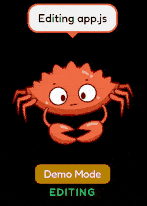
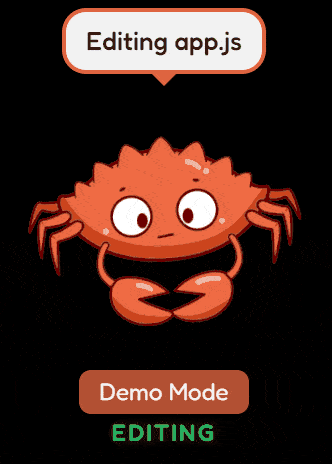
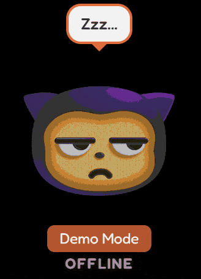
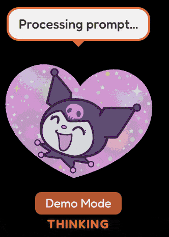
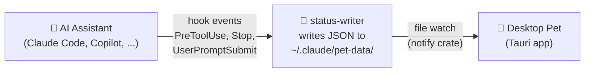

# Claude Status Pet

[English](README.md) | [中文](README.zh-CN.md)

A desktop pet that shows what your AI coding assistant is doing — in real time. 🦀

<table>
<tr>
<td align="center">

</td>
<td align="center">

</td>
<td align="center">

</td>
<td align="center">

</td>
</tr>
</table>

<details>
<summary>📸 More screenshots</summary>
<br>
<table>
<tr>
<td align="center">

</td>
<td align="center">

</td>
</tr>
</table>
</details>

## Quick Start

**Option 1 — Plugin install** (Claude Code):

```
/plugin marketplace add moeyui1/claude-status-pet
/plugin install claude-status-pet
```

**Option 1b — Plugin install** (GitHub Copilot CLI):

```
copilot plugin marketplace add moeyui1/claude-status-pet
copilot plugin install claude-status-pet-copilot
```

Then run `/pet update` to download the binary and assets.

**Option 2 — Ask your AI agent** (works with Claude Code, Copilot, etc.):

> Read https://raw.githubusercontent.com/moeyui1/claude-status-pet/main/docs/INSTALL.md and install it for me

That's it! A pet will appear on your next session. 🎉

## Features

- 🔴 **Real-time status** — watch your pet react as the assistant reads, edits, searches, thinks
- 🎭 **10+ characters** — Ferris (SVG), Mona & Kuromi (GIF DLC), and 6 ASCII art buddies
- 💃 **Animated** — unique animations per state (floating, wiggling, bouncing, sleeping)
- 🪟 **Multi-session** — each session gets its own pet window
- 🎨 **Customizable** — right-click to change character, colors, font size
- ⚡ **Lightweight** — ~5MB binary, ~20MB RAM (built with Tauri)

## Usage

**Right-click** the pet to open the menu:
- Switch character (Ferris, Mona, Kuromi, Chonk, Cat, Ghost, Robot, Duck, Axolotl, Snail)
- Customize colors, background, font size
- Exit the pet

**`/pet` commands** (in Claude Code or Copilot CLI):

| Command | Action |
|---------|--------|
| `/pet` or `/pet on` | Launch the pet |
| `/pet update` | Update binary, hooks, skill, and assets |
| `/pet status` | Show config and active sessions |

> **Tip:** Switch characters and customize colors via the right-click menu.

### Create Your Own Character

Ask your AI assistant:

> Read https://raw.githubusercontent.com/moeyui1/claude-status-pet/main/docs/CUSTOM-CHARACTERS.md and create a custom character pack for me

## GitHub Copilot Support

Also works with **GitHub Copilot CLI**! Install via plugin:

```
copilot plugin marketplace add moeyui1/claude-status-pet
copilot plugin install claude-status-pet-copilot
```

Or see [`copilot/README.md`](copilot/README.md) for manual setup.

Both tools can run simultaneously — each gets its own pet window.

## Other Installation Methods

<details>
<summary>🔧 Build from source</summary>

Prerequisites: [Rust](https://rustup.rs/), [Node.js](https://nodejs.org/)

```bash
git clone https://github.com/moeyui1/claude-status-pet.git
cd claude-status-pet/pet-app
npm install
npx tauri build
```

Binary output: `pet-app/src-tauri/target/release/claude-status-pet(.exe)`

</details>

## Uninstall

Right-click the pet → Exit to close it, then:

```
/plugin uninstall claude-status-pet
/plugin marketplace remove claude-status-pet
rm -rf ~/.claude/pet-data    # optional: remove downloaded assets
```

<details>
<summary>Manual uninstall</summary>

1. Remove hooks from `~/.claude/settings.json` (delete entries referencing `claude-status-pet`)
2. `rm -rf ~/.claude/skills/pet`
3. `rm -rf ~/.claude/pet-data`

</details>

## How It Works



The pet is **decoupled from any specific tool** — it just watches a JSON status file. See [`docs/HOOKS.md`](docs/HOOKS.md) for the full hook event → status mapping and how to add support for other assistants.

## Credits

- **Ferris**: [free-ferris-pack](https://github.com/MariaLetta/free-ferris-pack) by Maria Letta (CC0)
- **Mona**: [GitHub on GIPHY](https://giphy.com/GitHub) (downloaded at runtime)
- **Kuromi**: [Sanrio Korea on GIPHY](https://giphy.com/SanrioKorea) (downloaded at runtime)
- **ASCII sprites**: inspired by [any-buddy](https://github.com/cpaczek/any-buddy) by cpaczek
- Built with [Tauri](https://tauri.app/)

## License

[AGPL-3.0-only](LICENSE)
