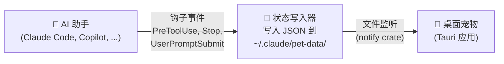

# Claude Status Pet

[English](README.md) | [中文](README.zh-CN.md)

[](https://github.com/moeyui1/claude-status-pet/actions/workflows/release.yml)
[](https://github.com/moeyui1/claude-status-pet/releases/latest)
[](LICENSE)
[](https://github.com/moeyui1/claude-status-pet/releases)
[](https://www.rust-lang.org/)

实时显示 AI 编程助手工作状态的桌面宠物 🦀

<table>
<tr>
<td align="center">

</td>
<td align="center">

</td>
<td align="center">

</td>
<td align="center">

</td>
</tr>
</table>

<details>
<summary>📸 更多截图</summary>
<br>
<table>
<tr>
<td align="center">

</td>
<td align="center">

</td>
</tr>
</table>
</details>

## 快速开始

**方式一 — 插件安装**（Claude Code）：

```
/plugin marketplace add moeyui1/claude-status-pet
/plugin install claude-status-pet
```

**方式一b — 插件安装**（GitHub Copilot CLI）：

```
copilot plugin marketplace add moeyui1/claude-status-pet
copilot plugin install claude-status-pet-copilot
```

安装后运行 `/pet update` 下载二进制和资源。

**方式二 — 让 AI 助手安装**（适用于 Claude Code、Copilot 等）：

> Read https://raw.githubusercontent.com/moeyui1/claude-status-pet/main/docs/INSTALL.md and install it for me

搞定！下次会话时桌面宠物就会出现 🎉

## 功能特性

- 🔴 **实时状态** — 宠物会随着助手读取、编辑、搜索、思考而做出不同反应
- 🎭 **10+ 角色** — Ferris（SVG）、Mona & Kuromi（GIF DLC）、6 种 ASCII 艺术小伙伴
- 💃 **动画效果** — 每种状态都有独特动画（浮动、摇摆、弹跳、睡觉）
- 🪟 **多会话支持** — 每个会话都有自己的宠物窗口
- 🎨 **自由定制** — 右键更换角色、调整颜色、字体大小
- ⚡ **轻量高效** — 约 5MB 体积、约 20MB 内存（基于 Tauri 构建）

## 使用方法

**右键点击**宠物打开菜单：
- 切换角色（Ferris、Mona、Kuromi、Chonk、Cat、Ghost、Robot、Duck、Axolotl、Snail）
- 自定义颜色、背景、字体大小
- 退出宠物

**`/pet` 命令**（Claude Code 或 Copilot CLI 中使用）：

| 命令 | 功能 |
|------|------|
| `/pet` 或 `/pet on` | 启动宠物 |
| `/pet update` | 更新二进制、钩子、技能和资源 |
| `/pet auto on/off` | 开关会话自动启动（仅 Claude Code） |
| `/pet status` | 查看配置和活跃会话 |

> **提示：** 通过右键菜单切换角色和自定义颜色。

### 创建你自己的角色

让你的 AI 助手执行：

> Read https://raw.githubusercontent.com/moeyui1/claude-status-pet/main/docs/CUSTOM-CHARACTERS.md and create a custom character pack for me

## GitHub Copilot 支持

同时支持 **GitHub Copilot CLI**！通过插件安装：

```
copilot plugin marketplace add moeyui1/claude-status-pet
copilot plugin install claude-status-pet-copilot
```

或参阅 [`copilot/README.md`](copilot/README.md) 进行手动配置。

两个工具可以同时运行 — 各自拥有独立的宠物窗口。

## 其他安装方式

<details>
<summary>🔧 从源码构建</summary>

前置条件：[Rust](https://rustup.rs/)、[Node.js](https://nodejs.org/)

```bash
git clone https://github.com/moeyui1/claude-status-pet.git
cd claude-status-pet/pet-app
npm install
npx tauri build
```

输出路径：`pet-app/src-tauri/target/release/claude-status-pet(.exe)`

</details>

## 卸载

右键宠物 → 退出来关闭，然后：

```
/plugin uninstall claude-status-pet
/plugin marketplace remove claude-status-pet
rm -rf ~/.claude/pet-data    # 可选：删除下载的资源
```

<details>
<summary>手动卸载</summary>

1. 从 `~/.claude/settings.json` 中删除引用了 `claude-status-pet` 的钩子配置
2. `rm -rf ~/.claude/skills/pet`
3. `rm -rf ~/.claude/pet-data`

</details>

## 工作原理



宠物应用**与具体工具完全解耦** — 它只监听一个 JSON 状态文件。完整的钩子事件到状态映射请参阅 [`docs/HOOKS.md`](docs/HOOKS.md)。

## 致谢

- **Ferris**：[free-ferris-pack](https://github.com/MariaLetta/free-ferris-pack)，Maria Letta 作品（CC0 许可）
- **Mona**：[GitHub on GIPHY](https://giphy.com/GitHub)（运行时从 GIPHY 下载）
- **Kuromi**：[Sanrio Korea on GIPHY](https://giphy.com/SanrioKorea)（运行时从 GIPHY 下载）
- **ASCII 角色**：灵感来自 [any-buddy](https://github.com/cpaczek/any-buddy)，cpaczek 作品
- 基于 [Tauri](https://tauri.app/) 构建

## 许可证

[AGPL-3.0-only](LICENSE)
