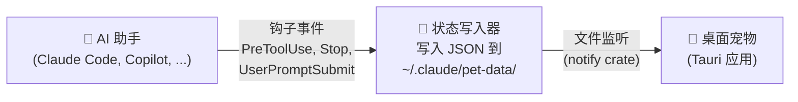

# Claude Status Pet

[English](README.md) | [中文](README.zh-CN.md)

实时显示 AI 编程助手工作状态的桌面宠物 🦀

<table>
<tr>
<td align="center">

</td>
<td align="center">

</td>
<td align="center">

</td>
<td align="center">

</td>
</tr>
</table>

<details>
<summary>📸 更多截图</summary>
<br>
<table>
<tr>
<td align="center">

</td>
<td align="center">

</td>
</tr>
</table>
</details>

## 快速开始

**方式一 — 插件安装**（Claude Code）：

```
/plugin marketplace add moeyui1/claude-status-pet
/plugin install claude-status-pet
```

**方式二 — 让 AI 助手安装**（适用于 Claude Code、Copilot 等）：

> Read https://raw.githubusercontent.com/moeyui1/claude-status-pet/main/INSTALL.md and install it for me

搞定！下次会话时桌面宠物就会出现 🎉

## 功能特性

- 🔴 **实时状态** — 宠物会随着助手读取、编辑、搜索、思考而做出不同反应
- 🎭 **10+ 角色** — Ferris（SVG）、Mona & Kuromi（GIF DLC）、6 种 ASCII 艺术小伙伴
- 💃 **动画效果** — 每种状态都有独特动画（浮动、摇摆、弹跳、睡觉）
- 🪟 **多会话支持** — 每个会话都有自己的宠物窗口
- 🎨 **自由定制** — 右键更换角色、调整颜色、字体大小
- ⚡ **轻量高效** — 约 5MB 体积、约 20MB 内存（基于 Tauri 构建）

## 使用方法

**右键点击**宠物打开菜单：
- 切换角色（Ferris、Mona、Kuromi、Chonk、Cat、Ghost、Robot、Duck、Axolotl、Snail）
- 自定义颜色、背景、字体大小
- 退出宠物

**`/pet` 命令**（Claude Code 中使用）：

| 命令 | 功能 |
|------|------|
| `/pet` 或 `/pet open` | 为所有活跃会话打开宠物 |
| `/pet close` | 关闭所有运行中的宠物 |
| `/pet set <角色>` | 设置默认角色 |
| `/pet auto on/off` | 开关会话自动启动 |
| `/pet status` | 查看配置和活跃会话 |

## GitHub Copilot 支持

同时支持 **GitHub Copilot CLI** 和 **Copilot Coding Agent**！详见 [`copilot/README.md`](copilot/README.md)。

两个工具可以同时运行 — 各自拥有独立的宠物窗口。

## 其他安装方式

<details>
<summary>📥 下载预编译二进制</summary>

从 [GitHub Releases](https://github.com/moeyui1/claude-status-pet/releases) 下载：

| 平台 | 文件 |
|------|------|
| Windows x64 | `claude-status-pet-windows-x64.exe` |
| macOS ARM (Apple Silicon) | `claude-status-pet-macos-arm64` |
| macOS Intel | `claude-status-pet-macos-x64` |
| Linux x64 | `claude-status-pet-linux-x64` |

下载后参照 [INSTALL.md](INSTALL.md) 配置钩子。

</details>

<details>
<summary>🔧 从源码构建</summary>

前置条件：[Rust](https://rustup.rs/)、[Node.js](https://nodejs.org/)

```bash
git clone https://github.com/moeyui1/claude-status-pet.git
cd claude-status-pet/pet-app
npm install
npx tauri build
```

输出路径：`pet-app/src-tauri/target/release/claude-status-pet(.exe)`

</details>

<details>
<summary>⚙️ 手动配置钩子（Claude Code）</summary>

在 `~/.claude/settings.json` 中添加：

```json
{
  "hooks": {
    "UserPromptSubmit": [
      { "hooks": [{ "type": "command", "command": "bash /path/to/claude-status-pet/scripts/status-writer.sh", "async": true }] }
    ],
    "PreToolUse": [
      { "hooks": [{ "type": "command", "command": "bash /path/to/claude-status-pet/scripts/status-writer.sh", "async": true }] }
    ],
    "Stop": [
      { "hooks": [{ "type": "command", "command": "bash /path/to/claude-status-pet/scripts/status-writer.sh", "async": true }] }
    ],
    "SessionStart": [
      { "matcher": "startup", "hooks": [{ "type": "command", "command": "bash /path/to/claude-status-pet/scripts/launch-pet.sh", "async": true }] }
    ],
    "SessionEnd": [
      { "hooks": [{ "type": "command", "command": "bash /path/to/claude-status-pet/scripts/status-writer.sh", "async": true }] }
    ]
  }
}
```

将 `/path/to/claude-status-pet` 替换为实际的项目路径。

**安装 `/pet` 技能：**

```bash
cp -r skills/pet ~/.claude/skills/pet
```

</details>

## 卸载

```
/pet close
/plugin uninstall claude-status-pet
/plugin marketplace remove claude-status-pet
rm -rf ~/.claude/pet-data    # 可选：删除下载的资源
```

<details>
<summary>手动卸载</summary>

1. 从 `~/.claude/settings.json` 中删除引用了 `status-writer.sh` 和 `launch-pet.sh` 的钩子配置
2. `rm -rf ~/.claude/skills/pet`
3. `rm -rf ~/.claude/pet-data`

</details>

## 工作原理



宠物应用**与具体工具完全解耦** — 它只监听一个 JSON 状态文件。完整的钩子事件到状态映射请参阅 [`docs/HOOKS.md`](docs/HOOKS.md)。

## 致谢

- **Ferris**：[free-ferris-pack](https://github.com/MariaLetta/free-ferris-pack)，Maria Letta 作品（CC0 许可）
- **Mona**：[GitHub on GIPHY](https://giphy.com/GitHub)（运行时从 GIPHY 下载）
- **Kuromi**：[Sanrio Korea on GIPHY](https://giphy.com/SanrioKorea)（运行时从 GIPHY 下载）
- **ASCII 角色**：灵感来自 [any-buddy](https://github.com/cpaczek/any-buddy)，cpaczek 作品
- 基于 [Tauri](https://tauri.app/) 构建

## 许可证

MIT
